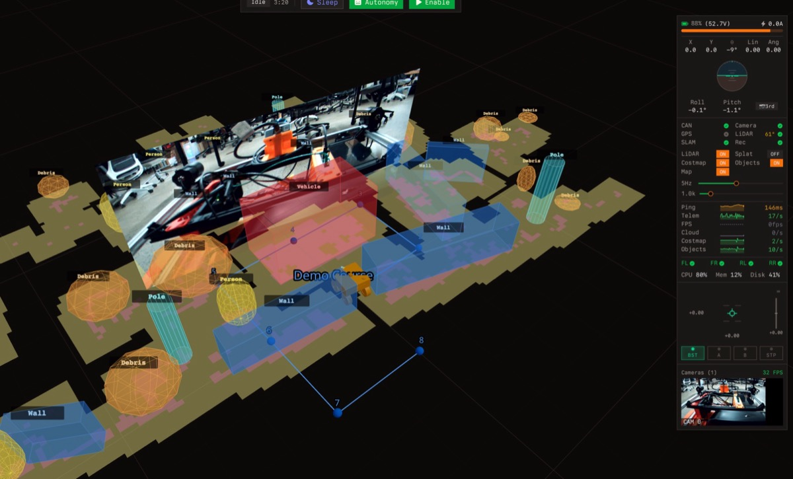
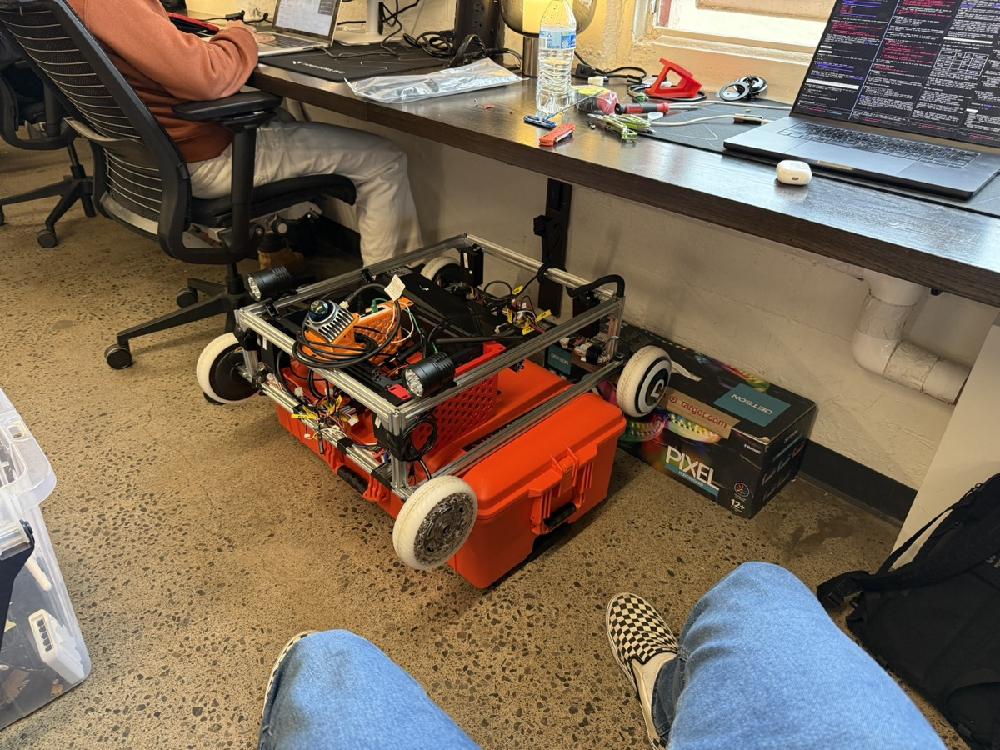

<p align="center">
  
</p>

<h1 align="center">slamwich 🥪</h1>

<p align="center">A 3D LiDAR SLAM library for Rust.</p>

<p align="center">
  
  
</p>

<p align="center"><em>Extracted from the <a href="https://github.com/muni-hq/muni">Muni</a> autonomous sidewalk robot project.</em></p>

## Features

- **3D GICP scan matching** — Robust point-to-plane ICP with local covariance weighting
- **Pose graph optimization** — Gauss-Newton with Huber robust weighting for loop closures
- **Loop closure detection** — Scan context descriptors for fast, rotation-invariant place recognition
- **EKF state estimation** — Fuses odometry with scan match corrections
- **IMU pre-integration** — Optional gyroscope integration for improved turn handling
- **Map persistence** — Save/load maps to binary files with atomic writes

## Usage

```rust
use slamwich::{SlamConfig, SlamProcessor, PointCloud, Point3D, Pose};

// Create a SLAM processor
let config = SlamConfig::default();
let mut slam = SlamProcessor::new(config);

// Feed odometry at high rate (~100Hz)
slam.update_odometry(&Pose { x: 0.1, y: 0.0, theta: 0.01 });

// Process LiDAR scans at scan rate (~10Hz)
let scan = PointCloud::new(vec![
    Point3D { x: 1.0, y: 0.0, z: 0.5, reflectivity: 128, tag: 0 },
    // ... more points
]);

if let Some(update) = slam.process_scan(&scan) {
    println!("Pose: ({:.2}, {:.2}, {:.2})",
        update.world_pose.x,
        update.world_pose.y,
        update.world_pose.theta);
    println!("Keyframes: {}, Loop closures: {}",
        update.keyframe_count,
        update.loop_closure_count);
}
```

## Configuration

Key parameters in `SlamConfig`:

| Parameter | Default | Description |
|-----------|---------|-------------|
| `voxel_size` | 0.2m | GICP downsampling resolution |
| `max_correspondence_dist` | 1.0m | Outlier rejection threshold |
| `keyframe_distance` | 1.0m | Min travel before new keyframe |
| `keyframe_rotation` | 0.5rad | Min rotation before new keyframe |
| `loop_closure_threshold` | 0.7 | Min score to accept loop closure |

## Algorithm Overview

1. **Odometry prediction** — EKF predicts pose from wheel encoder deltas
2. **Scan matching** — 3D GICP aligns current scan to reference keyframe
3. **EKF update** — Scan match result corrects odometry drift
4. **Keyframe insertion** — New keyframe added when robot moves enough
5. **Loop closure detection** — Scan context finds revisited places
6. **Graph optimization** — Pose graph corrected when loop closed

## References

- GICP: Segal et al., "Generalized-ICP" (RSS 2009)
- Scan Context: Kim & Kim, "Scan Context: Egocentric Spatial Descriptor for Place Recognition" (IROS 2018)

## License

MIT
